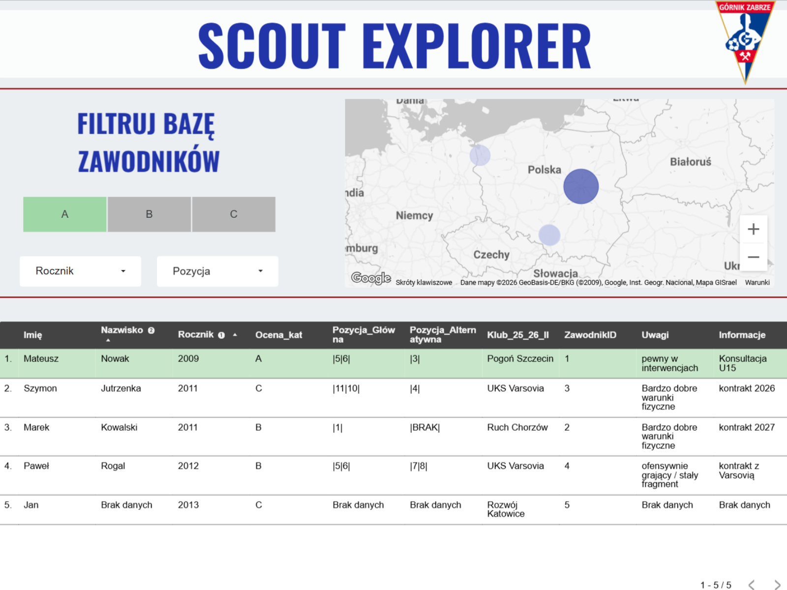
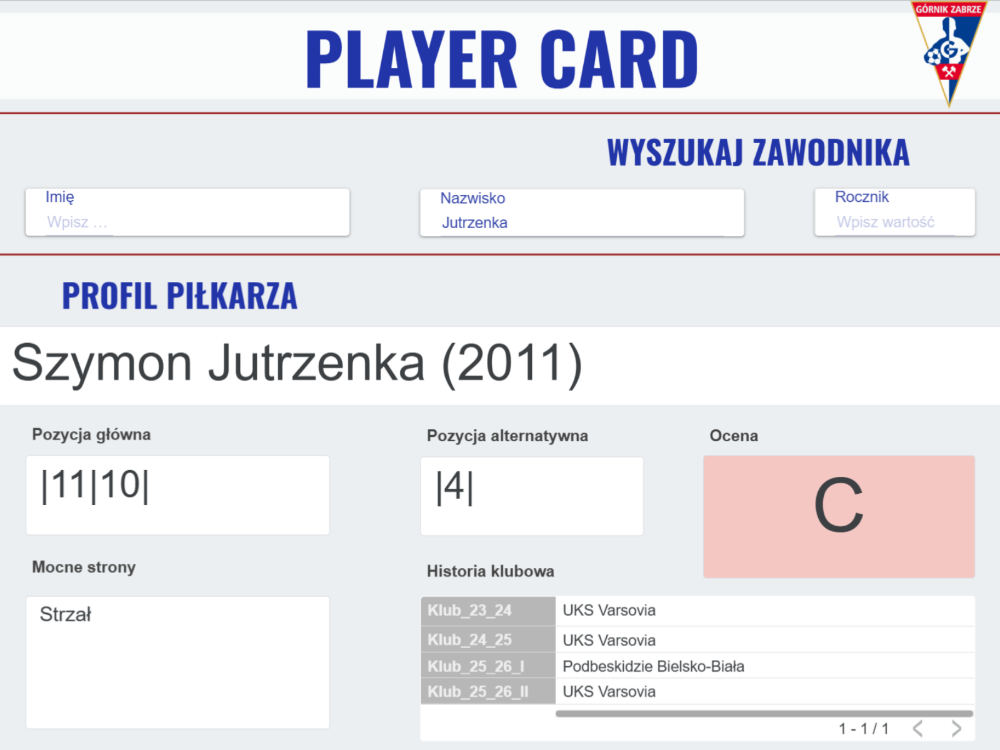
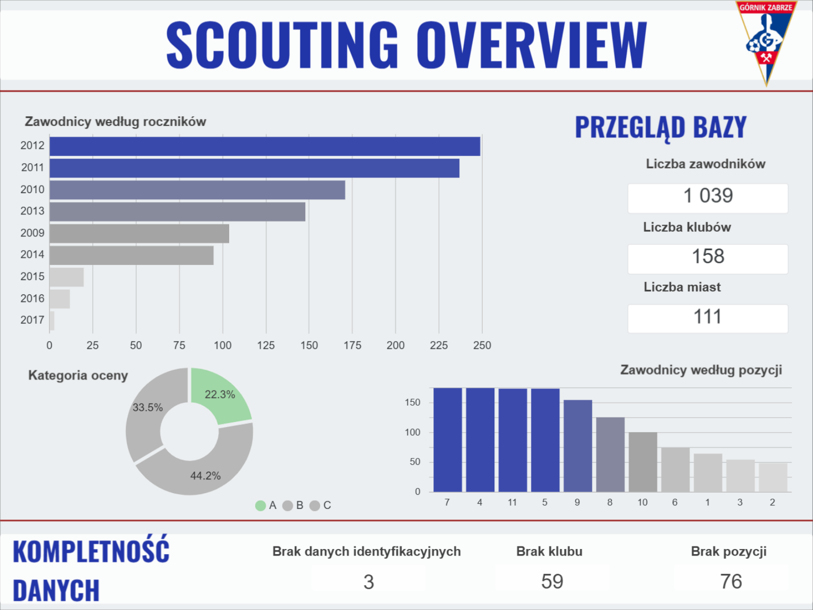

# Scouting Dashboard System

Handles 1,000+ records with multi-layer data transformation  
(RAW → STG → CLEAN → ANALYTICS)

## Overview

Scouting system for football player analysis built with SQL, Looker Studio and automated data workflow.

The goal is to transform raw scouting data into a structured, analytics-ready model.

---

## System architecture

Data pipeline:

RAW → STG → CLEAN → ANALYTICS → DASHBOARD

---

## Key components

### 1. Data model (SQL)

- data cleaning and standardization
- club name mapping and normalization
- position formatting (e.g. `|1| |2|`)
- handling missing values and duplicates

---

### 2. Analytical views

#### `vw_scout_clean`

Primary analytical view containing:

- player information
- scout notes
- filter-ready positional data
- dashboard-oriented scouting fields

#### `vw_scout_table2_analytics_clean`

Secondary analytical dataset containing:

- binary attributes (`0/1`)
- expanded positional roles
- structured player strengths
- analytical feature model

---

### 3. Dashboard (Looker Studio)

The reporting layer consists of three analytical views:

#### Scout Explorer
Interactive player filtering using:
- scouting category (A/B/C)
- position
- birth year
- geographical view (map)

#### Player Card
Individual player profile view containing:
- player history
- positions
- strengths
- scouting summary

#### Scouting Overview
Aggregate scouting insights:
- player distribution
- position distribution
- age structure
- scouting quality metrics

---

## Dashboard Preview

> **Note:** Player-level screenshots were anonymized for portfolio purposes.  
> Sample names and clubs were replaced with demo data while preserving the dashboard structure and functionality.

### Scout Explorer (portfolio demo)

Interactive filtering interface for player scouting and database exploration.

---

### Player Card (portfolio demo)

Individual player profile generated dynamically after player search.

---

### Scouting Overview (real dashboard view)

Aggregate statistics and scouting KPIs based on the production dataset.

---

### 4. Data automation (in progress)

- Google Forms for structured player input
- validation layer to reduce missing data and typos
- Google Sheets staging workflow
- automated transformation into SQL-ready format
- email notification sent to scouting coordinator

---

## Purpose

To build a structured scouting system supporting:

- player evaluation
- scouting workflow
- interactive filtering
- reporting and decision-making

---

## Status

**MVP / test phase**

Current stage:
- dashboard testing with scouts
- feedback collection
- ongoing automation of player insertion workflow
